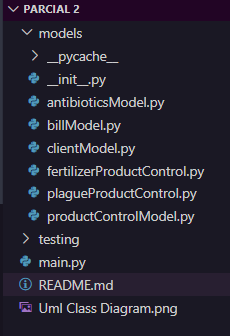
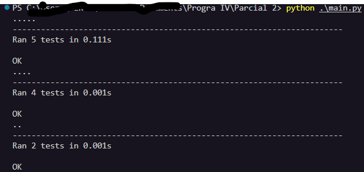
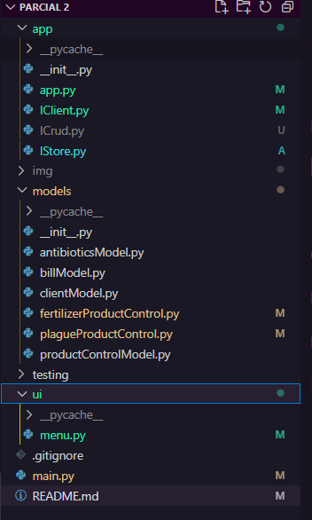
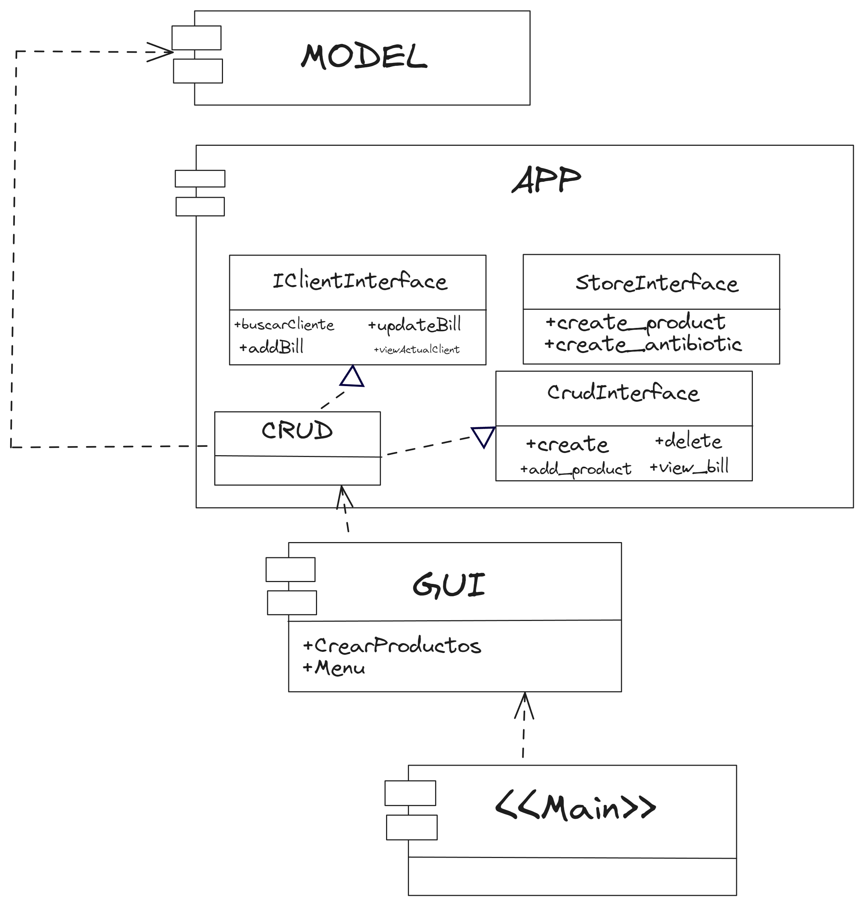
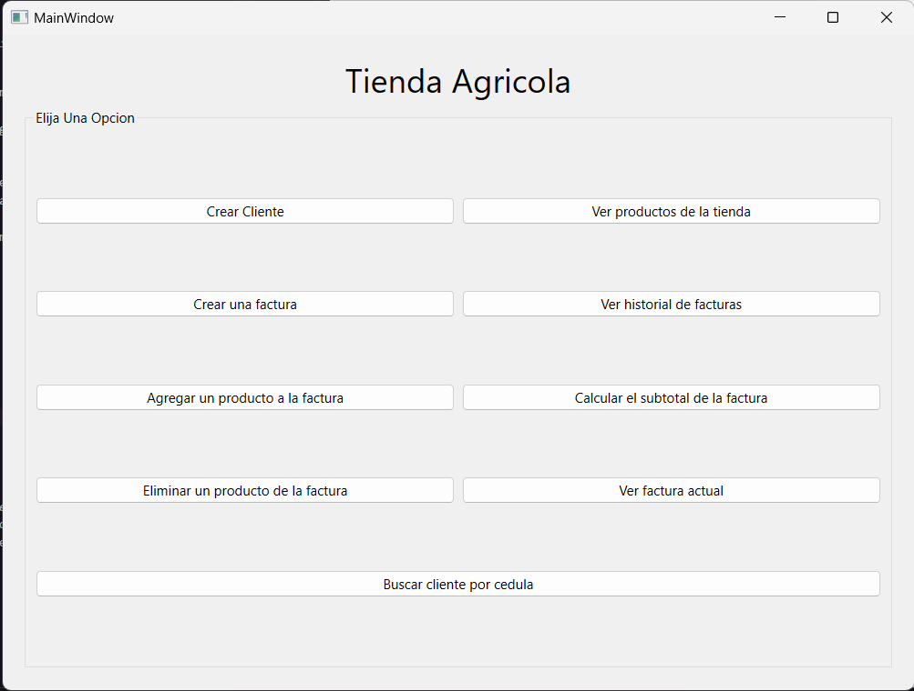
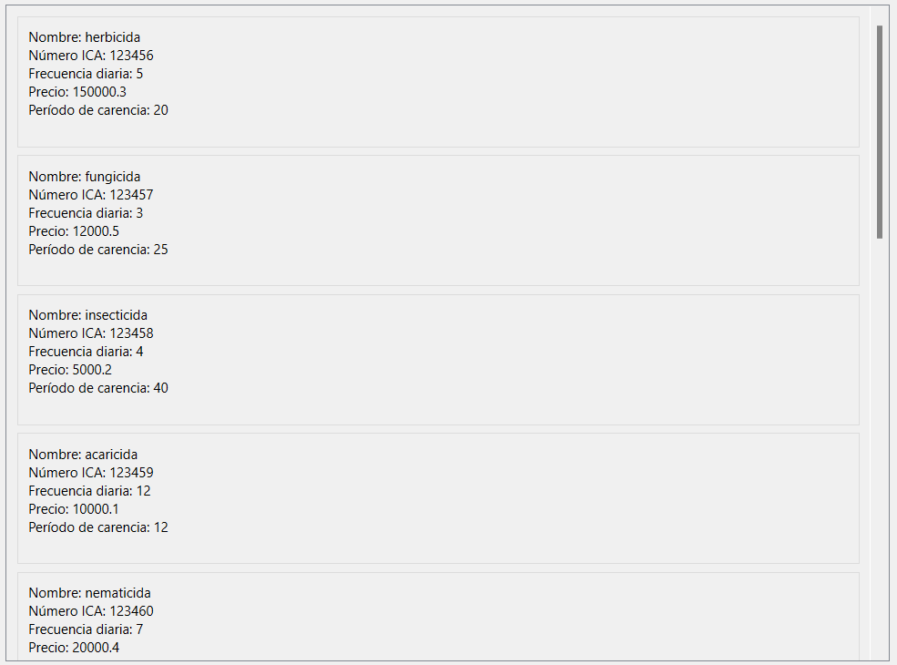
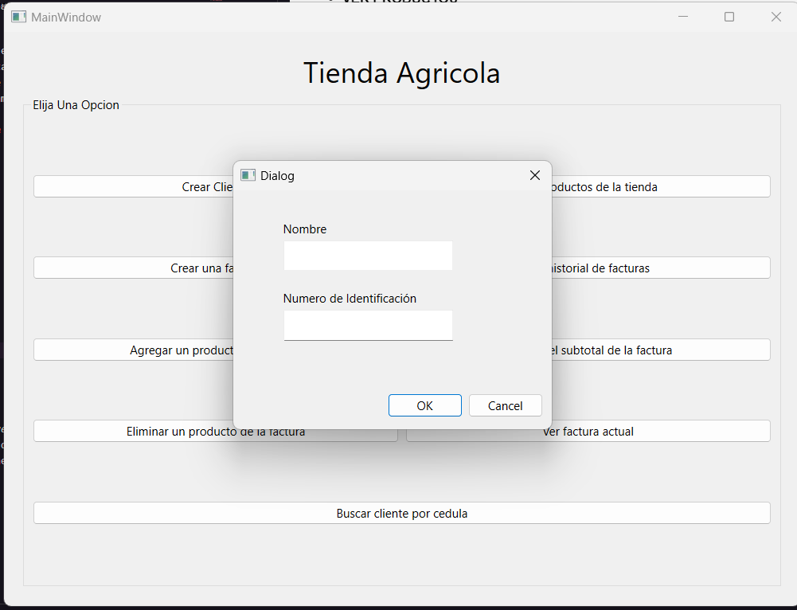
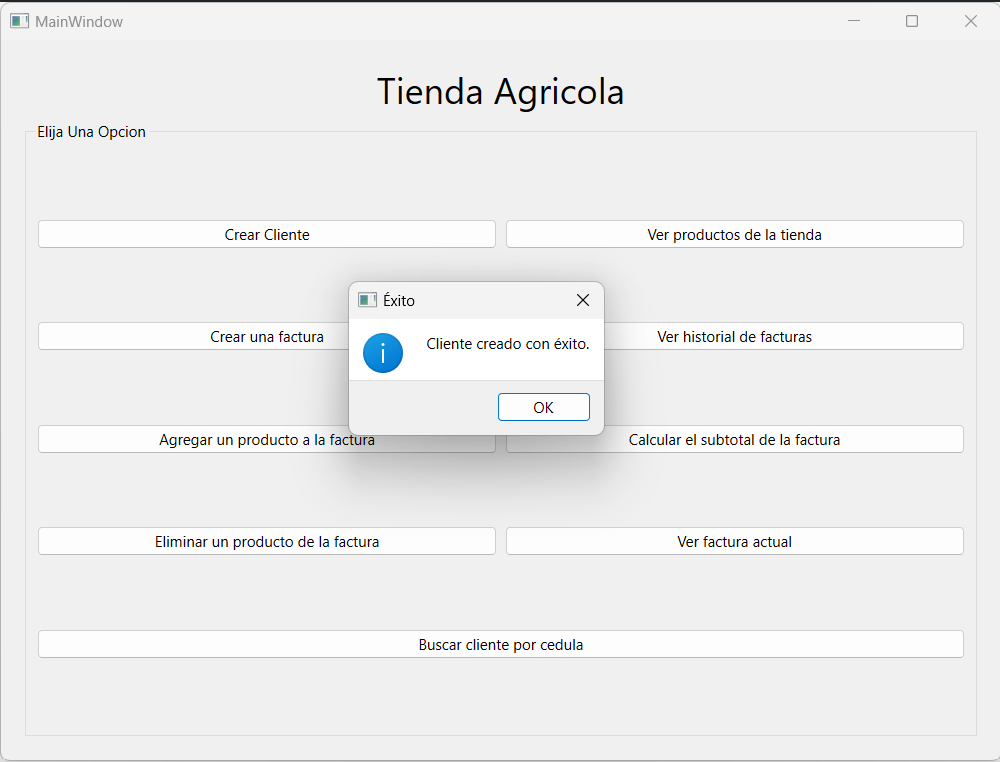

## Agricultural Billing System
[Spanish](README-ES.md)
[English](README-EN.md)
## Table of Contents
- [Part 1](#project-structure)
- [Part 2](#adding-interfaces)
- [Part 3](#gui-graphical-user-interface)
## Introduction
This project is a billing system designed for an agricultural store that handles control products (fertilizers and pest controls) and farm animal medicine, specifically antibiotics. The system allows to manage orders (or invoices) that are composed of the products to be purchased, facilitating the sales process and inventory management.
For a more global view see the class diagram:

## Requirements
### Prerequisites
Before you start, make sure you meet the following requirements:
- Have Python installed.
### Installation
To install the project, follow these steps:
1. Clone the repository on your local machine.
Navigate to the project directory.
## Project Structure

The project is organized into several modules, each with specific functionality:
- `models/clientModel.py`: Defines the `Client class to handle client information.
- `models/billModel.py`: Defines the `Bill` class to handle bill information.
- `models/antibioticsModel.py`: Defines the `Antibiotic` class to handle antibiotic information.
- `models/productControlModel.py`: Defines the `ProductControl` class and its subclasses `plague_ProductControl` and `FertilizerProductControl` to handle control product information.
## Usage
The focus of this first part of the project is intended to perform Unit Tests, so a `main.py` file has been created to perform tests of the created models. Below is an example of how to use the models created in the project:
  
  ````python
## Tests
To run the tests, navigate to the test directory and run `python .main.py`.
````

a debub has been performed to see the relationship between the objects and verify that they are being created correctly as well as being related in the correct way.


## Adding Interfaces
For this part of the project we have added interfaces in order to increase the modularization of the code, as well as its scalability.
### Component Diagram with Interface Implementation

A clarification is in order: *the call of the "Crud" in the Main only has as objective the "creation" of the store*.
This would be The Project Structure with the implementation of Interfaces
<br>



Short example of how we implement the interfaces in the project.


# GUI (Graphical User Interface)
**IMPORTANT NOTE**: for this Part 3 it is important to install the "requirements.txt" file in order to run the project correctly.
````bash
pip install -r requirements.txt
python main.py
````
For the 3rd part of this project we have been asked to develop a graphical interface for the agricultural billing system, for this we have used as a tool [QT Designter](https://doc.qt.io/qt-6/qtdesigner-manual.html), which allows us to create graphical interfaces from a graphical environment and then export them to a .ui file that we can use in our project by creating each view in a ".py" file.
- Positive aspects of this tool:* * Ease of use
  - Ease of use
  - Speed in the creation of interfaces
  - Ease of exporting to a .ui file.
  - Easy to create a .py file
  - It is very useful because it helps to modularize the code and to have a better organization of the project.
You can view the ".ui" files in [This Folder](./GUI/QT%20Designs/)
## GUI Project Structure
We used a structure where the GUI component will be called from the main to run the GUI.
This "GUI" component is structured as follows:

However, compared to part 2, in this part we have created a file "productsCreated.py" which is where we are creating the store as such, that is to say, we are creating the products that will be sold in the store. This way we do not create anything in the main and we only call the graphical interface.

## Component Diagram with GUI Implementation


## Class Diagram with GUI Implementation


## Graphical Interface Result
- **MENU**


- **VIEW PRODUCTS**


- **Create Customer**
 

- **Messages**



## License
This project was developed by *Jeronimo Riveros* and *Daniel Rosas* for learning purposes. You can use the code of this project for your own purposes, but you can't use it for commercial purposes.