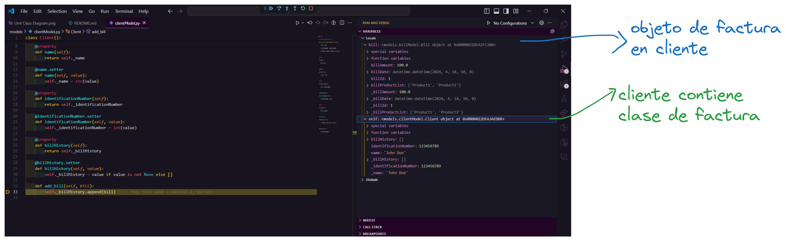
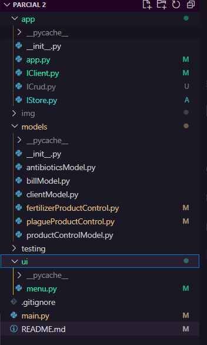
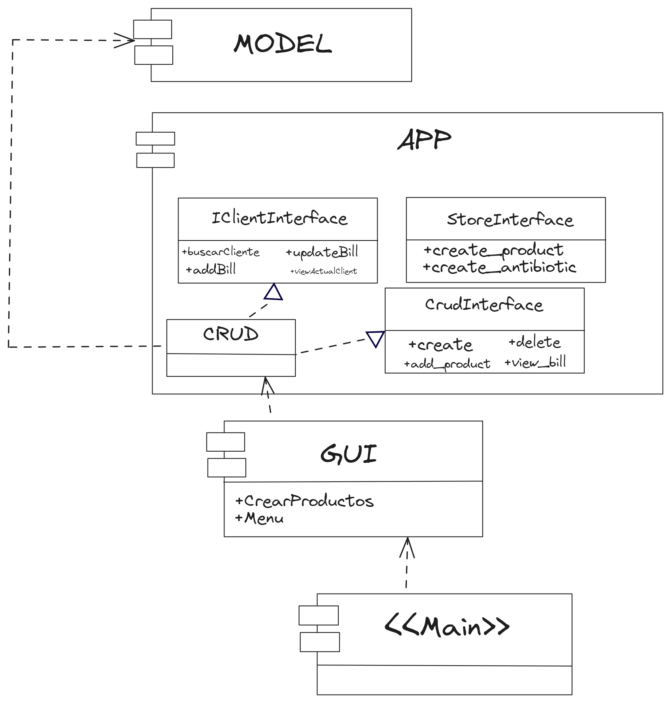
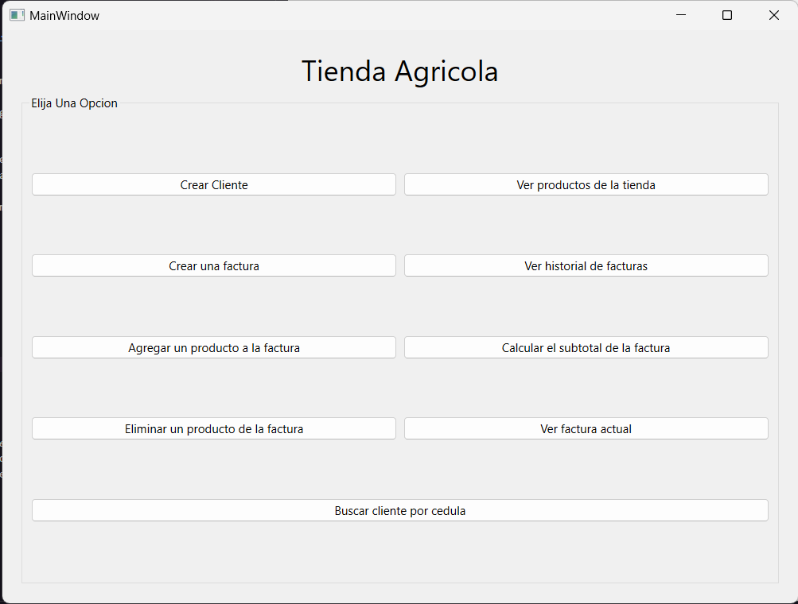
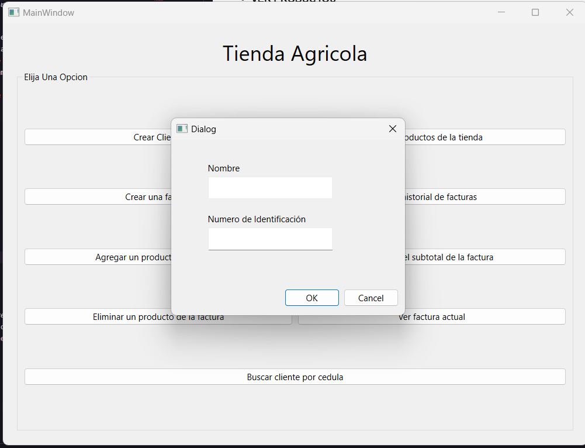
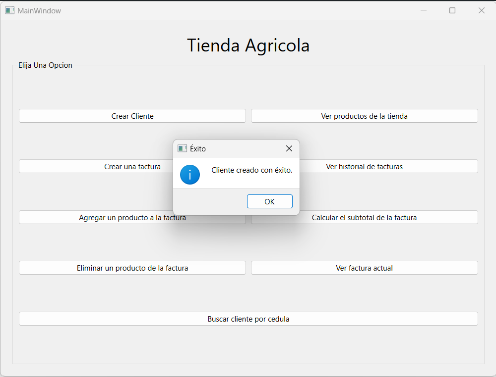

# Sistema de Facturación Agrícola
[Español](README-ES.md)
[Ingles](README-EN.md)
## Tabla de Contenidos

- [Parte 1](#estructura-del-proyecto)
- [Parte 2](#añadiendo-interfaces)
- [Parte 3](#gui-graphical-user-interface)

## Introducción

Este proyecto es un sistema de facturación diseñado para una tienda agrícola que maneja productos de control (fertilizantes y controles de plagas) y medicina para animales de granja, específicamente antibióticos. El sistema permite gestionar pedidos (o facturas) que están compuestos por los productos que serán comprados, facilitando el proceso de venta y la gestión de inventario.

Para tener una vision mas global ver el diagrama de clases:


## Requerimientos

### Prerequisitos

Antes de comenzar, asegúrate de cumplir con los siguientes requisitos:

- Tener instalado Python.

### Instalación

Para instalar el proyecto, sigue estos pasos:

1. Clona el repositorio en tu máquina local.
2. Navega al directorio del proyecto.

## Estructura del Proyecto


El proyecto está organizado en varios módulos, cada uno con una funcionalidad específica:

- `models/clientModel.py`: Define la clase `Client` para manejar la información de los clientes.
- `models/billModel.py`: Define la clase `Bill` para manejar la información de las facturas.
- `models/antibioticsModel.py`: Define la clase `Antibiotic` para manejar la información de los antibióticos.
- `models/productControlModel.py`: Define la clase `ProductControl` y sus subclases `plague_ProductControl` y `FertilizerProductControl` para manejar la información de los productos de control.

## Uso

El enfoque de esta primera parte del proyecto esta pensada para realizar Test Unitarios, por lo que se ha creado un archivo `main.py` para realizar pruebas de los modelos creados. A continuación, se muestra un ejemplo de cómo utilizar los modelos creados en el proyecto:
  
  ```python
## Pruebas

Para ejecutar las pruebas, navega al directorio de pruebas y ejecuta `python .\main.py`.
```


se ha realizado un debub para ver la relacion entre los objetos y verificar que se esten creando correctamente ademas de estar relacionados de la forma correcta.




## Añadiendo Interfaces
para esta parte del proyecto se han añadido interfaces con el fin de aumentar la modularizacion del codigo, asi como su escalabilidad

### *Diagrama de Componentes con Implementacion de Interfaces*


Cabe hacer una aclaración: *el llamado del "Crud" en el Main unicamente tiene como objetivo la "creacion" de la tienda*

Esta seria La Estrucura Del Proyecto con la implementacion de Interfaces



Corto Ejemplo De como implementamos las interfaces en el proyecto


# GUI (Graphical User Interface)
**NOTA IMPORTANTE**: para esta Parte 3 es importante Instalar el archivo "requirements.txt" para poder ejecutar el proyecto correctamente.

```bash
pip install -r requirements.txt
python main.py
```

Para la 3er parte de este proyecto se ha pedido desarrollar una interfaz grafica para el sistema de facturacion agricola, para ello se ha utilizado como herramienta a [QT Designter](https://doc.qt.io/qt-6/qtdesigner-manual.html), la cual nos permite crear interfaces graficas desde un entorno grafico y luego exportarlas a un archivo .ui que podremos utilizar en nuestro proyecto creando los cada vista en un archivo ".py".

- *Aspectos positivos de esta herramienta:*
  - Facilidad de uso
  - Rapidez en la creacion de interfaces
  - Facilidad de exportar a un archivo .ui
  - Facilidad de crear a un archivo .py
  - Sirve de mucho ya que ayuda a modularizar el codigo y a tener una mejor organizacion del proyecto

Puedes Ver los archivos ".ui" en [Esta Carpeta](./GUI/QT%20Designs/)

## Estructura del Proyecto con GUI
Se utilizo una estructura donde se llamara al componente de GUI desde el main para asi ejecutar las interfaz Grafica.
Este Componente "GUI" esta estructurado de la siguiente manera:


Sin embargo a comparacion que en la parte 2, en esta parte se ha creado un archivo "productsCreated.py" que es en donde estamos creando la tienda como tal, es decir, estamos creando los productos que se venderan en la tienda. De esta forma no creamos nada en el main y solo llamamos a la interfaz grafica.

## Diagrama de Componentes con Implementacion de GUI


## Diagrama de Clases con Implementacion de GUI


## Resultado de la Interfaz Grafica
- **MENU**


- **VER PRODUCTOS**


- **Crear Cliente**

- **Mensajes**



## Licencia

Este proyecto fue desarrollado por *Jeronimo Riveros* y *Daniel Rosas* con fines de aprendizaje. Puedes utilizar el código de este proyecto para tus propios fines, pero no puedes utilizarlo con fines comerciales.